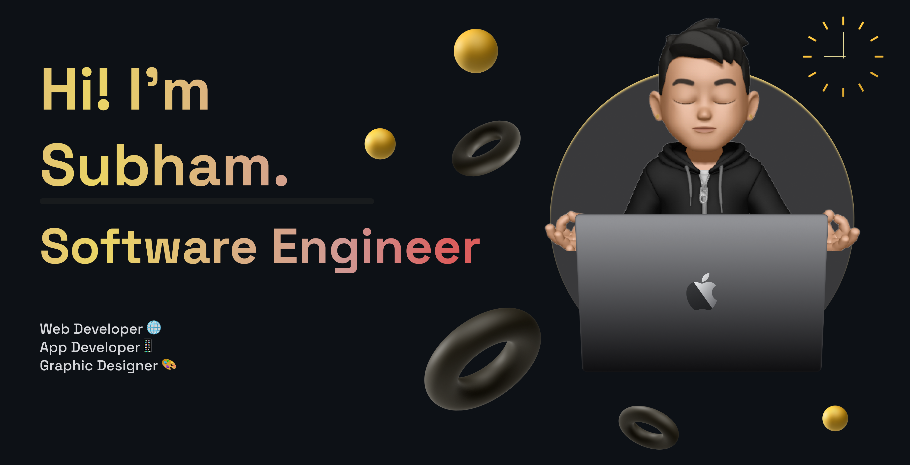

Hi there, I'm Subham Paul
===================================================================================================================================

I'm a **Computer Science and Engineering student** passionate about crafting:  
🌐**Elegant full-stack web applications**
📱**Intuitive mobile experiences**
🎨**Captivating UI/UX designs**

* 🌍  I'm based in Kolkata
* 🖥️  See my portfolio at [MyPortfolio](https://subham-paul.vercel.app/)
* 🧠  I'm learning Next.js, Kotlin
* 🤝  I’m always open to collaborating on interesting and innovative projects

### 🚀Skills & Tools:

### 🌐Connect with Me

 <a href="https://www.github.com/ItisSubham" target="_blank" rel="noreferrer"> <picture> <source media="(prefers-color-scheme: dark)" srcset="https://raw.githubusercontent.com/danielcranney/readme-generator/main/public/icons/socials/github-dark.svg" /> <source media="(prefers-color-scheme: light)" srcset="https://raw.githubusercontent.com/danielcranney/readme-generator/main/public/icons/socials/github.svg" />  </picture> </a> <a href="https://www.linkedin.com/in/iam-subham-paul" target="_blank" rel="noreferrer"> <picture> <source media="(prefers-color-scheme: dark)" srcset="https://raw.githubusercontent.com/danielcranney/readme-generator/main/public/icons/socials/linkedin-dark.svg" /> <source media="(prefers-color-scheme: light)" srcset="https://raw.githubusercontent.com/danielcranney/readme-generator/main/public/icons/socials/linkedin.svg" />  </picture> </a> <a href="https://www.x.com/ItisSubham" target="_blank" rel="noreferrer"> <picture> <source media="(prefers-color-scheme: dark)" srcset="https://raw.githubusercontent.com/danielcranney/readme-generator/main/public/icons/socials/twitter-dark.svg" /> <source media="(prefers-color-scheme: light)" srcset="https://raw.githubusercontent.com/danielcranney/readme-generator/main/public/icons/socials/twitter.svg" />  </picture> </a>

---

✨ "Designing and coding with purpose and passion!"
